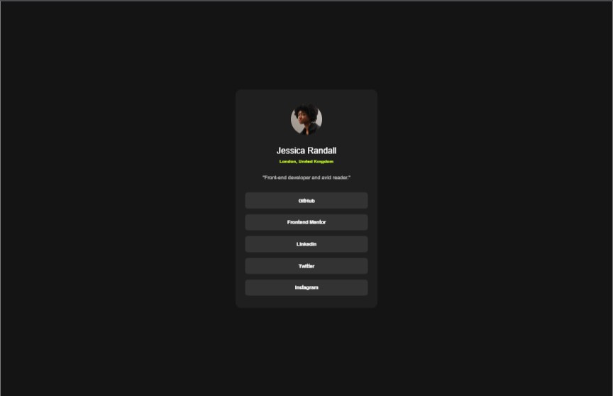

# Frontend Mentor - Social Links Profile solution

This is a solution to the [Social links profile challenge on Frontend Mentor](https://cgmatrix.github.io/frontendmentor.io_social-links-profile/). Frontend Mentor challenges help you improve your coding skills by building realistic projects.

## Table of contents

- [Overview](#overview)
  - [The challenge](#the-challenge)
  - [Screenshot](#screenshot)
  - [Links](#links)
- [My process](#my-process)
  - [Built with](#built-with)
  - [What I learned](#what-i-learned)
  - [Continued development](#continued-development)
  - [Useful resources](#useful-resources)
  - [AI Collaboration](#ai-collaboration)
- [Author](#author)
- [Acknowledgments](#acknowledgments)

## Overview

### The challenge

Users should be able to:

- See hover and focus states for all interactive elements on the page.

### Screenshot




### Links

- Live Site URL: [https://cgmatrix.github.io/frontendmentor.io_blog-preview-card/](https://cgmatrix.github.io/frontendmentor.io_social-links-profile/)

## My process

### Built with:

- Semantic HTML5 markup
- CSS custom properties
- Flexbox
- Desktop-first workflow

### What I learned:

This exercise helped me to recap the use of:
- CSS flexbox
- Media queries - @media
- Pseudo code - :hover
 
This code practise also helped me to build further skills for building a responsive web page by starting with mobile first, instead of desktop.

Example of code snippest after research on MDN:
```html
<footer class="attribution">
  <p>
    Challenge by <a class="button" href="https://www.frontendmentor.io?ref=challenge">Frontend Mentor</a>.
  </p>
  <p>
    Coded by <a class="button" href="https://www.frontendmentor.io/profile/CgMatrix">CgMatrix</a>.
  </p>
</footer>
```

```css
.attribution {
  color: hsl(0, 0%, 7%);
  font-size: 0.68rem;
  font-weight: 500;
}

.button {
  font-size: 0.7rem;
  font-weight: 800;
  color: inherit;
  text-decoration: none;
}

.button:hover {
  color: hsl(0, 0%, 100%);
}
.button:focus {
  background-color: hsl(0, 0%, 100%);
  color: hsl(47, 88%, 63%);
}
```

### Continued development:

Use this section to outline areas that you want to continue focusing on in future projects. These could be concepts you're still not completely comfortable with or techniques you found useful that you want to refine and perfect.

Based on extending skills for future projects, I'm planning to focus more on the following:
- SaaS
- React.js

### Useful resources:

- [MDN Web Docs](https://developer.mozilla.org/en-US/) - This always helped me to regain knowledge of stuff I've forgotten.
- [CSS Tricks](https://css-tricks.com/) - This is an amazing webiste that contains powerfull spreadsheets. 

### Experience:

When building responsive websites, I always first optimise the raw code of the layout I've started with (desktop or mobile) as much as possible before starting with media queries to setup the next layout for a different screen size.

## Author

- Github - [CgMatrix](https://github.com/CgMatrix)
- Frontend Mentor - [@CgMatrix](https://www.frontendmentor.io/profile/CgMatrix)

## Acknowledgments

Big thanks to Frontend Mentor for providing the challenge & design with resources to improve & develop more skills.
